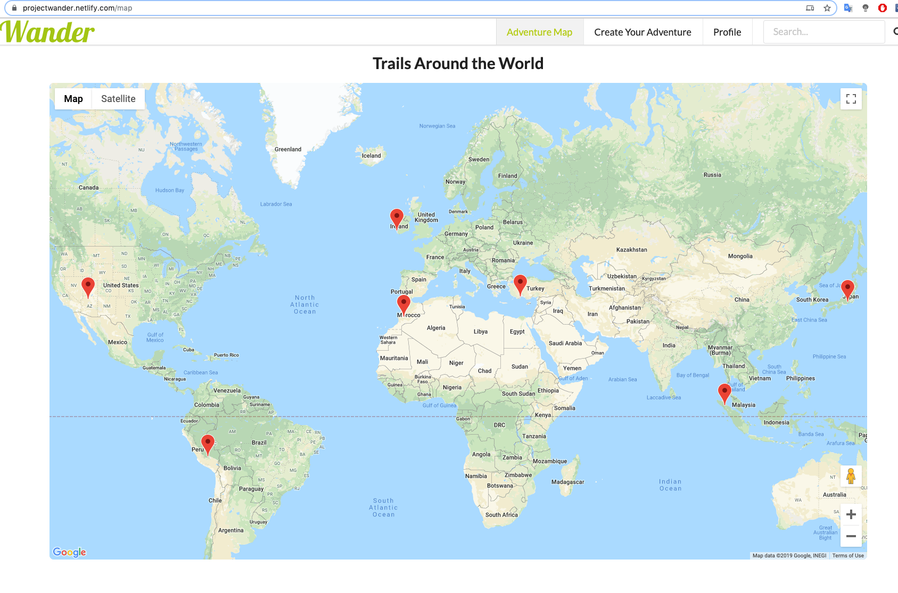

# Project Wander - Front-end Client
Wander is a platform built for nature & hiking lovers across the globe that share a passion for adventure. Wander let's you share your favorite trails with others by creating a trail and display it on our world map. It also let's you discover new ones by reading about other users trails.

The application was created, during 11 november - 23 november 2019, as a final project during the last 2 weeks of the Craft Academy [Full Stack Web Developer Bootcamp](https://craftacademy.se/english/). 

---
## Authors
[Pia von Wachenfelt](https://github.com/piavW)  
[Luca Lobacher](https://github.com/lucamarial)  
[Jonas Masharqa](https://github.com/jonas-masharqa)  
[David Izosimov](https://github.com/DavveDavve)  
[Alex Saxena](https://github.com/AlexSaxena)  

---
## Deloyment URL
This application consists of a front-end Client and a back-end API.  
[Front-end Deployment](https://projectwander.netlify.com/) and [Front-end GitHub](https://github.com/CraftAcademy/wander-client)  
[Back-end Deployment](https://c-wander-api.herokuapp.com/) and [Back-end GitHub](https://github.com/CraftAcademy/wander-api)

---
## User Stories & Project Management
During this project we worked agile using 7 day sprints, you can check the whole design sprint, read our user stories and our features on our [Pivotal Tracker board](https://www.pivotaltracker.com/n/projects/2416753). 

---
## Snapshot of the application

---
## Getting Started
If you want to try out the code for yourself on your local machine:
Fork the repo, clone it down, make sure you run `yarn install`. 

### Built with the following technologies
Back-end API:
- API with [Ruby](https://www.ruby-lang.org/en/), version 2.5.1
- API with[Ruby on Rails](https://rubyonrails.org/), verion 6.0.1
- API is using [RSpec](https://rspec.info/) for automated testing
- API is also using Gems, to check which ones please see the Gemfile

Front-end Client:
- Client with [React](https://reactjs.org/)
- Client is using [Cypress](https://www.cypress.io/) for automated testing
- User generated images are stored on [Amazon webstorage](https://aws.amazon.com/)
- Client is using the [Google Maps API](https://developers.google.com/maps/documentation) with the Google Maps React Package
- Client is styled using [Semantic UI React](https://react.semantic-ui.com/) and CSS.

---
### Testing, Test Coverage and Continuous Integration (CI)
To measure the API's test coverage we use [Coveralls](https://coveralls.io/) 

Continuous integration is handled using [Semaphore](https://semaphoreci.com/)   
 API  
 Client

All tests on the front-end Client can be found in the folder `cypress` and it's sub-folders. 

The front-end is currently connected to our back-end API, if you want to test it out yourself please go to our back-end GitHub and fork that repository as well. Then change the url from our Heroku to `http://localhost:3000`

To run a test (you must have yarn installed), run `yarn cy:open` in your terminal.

---
## Acknowledgements
- [Rails Guides](https://guides.rubyonrails.org/index.html) for guidance and documentation
- [React Docs](https://reactjs.org/docs/getting-started.html) for guidance and documentation
- [StackOverflow](https://stackoverflow.com/) for solutions to known issues
- [Image sources](https://npire.com.au/wp-content/uploads/2019/05/B9327681055Z.1_20170518174842_000_GCPI2D0G9.1-0-1920x1008.jpg)
- [Video source](https://player.vimeo.com/video/54802209?autoplay=1&loop=1)

---
## Special Thanks
To our coaches and staff at Craft Academy for guiding and turning us into developers: [Faraz](https://github.com/faraznaeem), [Greg](https://github.com/GergKllai1), [Adi](https://github.com/kianaditya), [Oliver](https://github.com/oliverochman), [Noel](https://github.com/Noelryn) and [Thomas](https://github.com/tochman)!

## License
This project is under the [MIT](https://opensource.org/licenses/MIT)-license